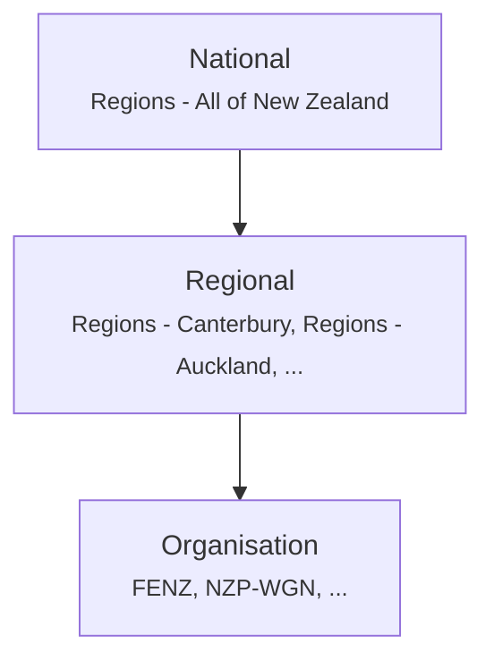

# Connecting Agencies

TAK.NZ is New Zealand's shared Common Operating Picture (COP) platform for emergency responders. It lets multiple agencies see each other on a shared map in real time during emergencies, training, or day-to-day operations — without needing to be on the same radio network or run compatible systems.

Every organisation on TAK.NZ has a standardised [callsign prefix](callsigns.md) and [colour](colour-coding.md), so anyone looking at the map can immediately tell who they're looking at. See [Colour Coding](colour-coding.md) for the full list of participating organisations.

## How the network is structured

TAK.NZ uses a three-layer **channel** structure to balance shared situational awareness with each organisation's need for internal coordination:

1. **National** — for events affecting the whole country
2. **Regional** — one channel per NZ region, and the primary coordination layer for any emergency event
3. **Organisation** — internal agency coordination that doesn't need to broadcast to every other responder

When an emergency happens in a region, every responding agency activates that region's channel and immediately sees everyone else who's active there — no manual configuration required. See [Channel Structure](channels.md) for the complete picture, including overseas deployment channels used when NZ personnel deploy to the Pacific or further afield.

## International partnerships

TAK.NZ is built on the same underlying platform as **COTAK** (the Colorado Team Awareness Kit), one of the most mature TAK deployments for civilian public safety in the world. This means training material, workflows, and lessons learned from COTAK's public safety community carry across directly to TAK.NZ.

New Zealand also has an established, ongoing role supporting Pacific Island nations during emergencies. TAK.NZ reflects this with standing `Overseas -` channels for Pacific partner countries, so agencies can maintain shared awareness and interoperability with the Pacific between deployments, not just during them.

## :material-robot-outline: RELAY: the TAK.NZ AI assistant

TAK.NZ includes **RELAY** (Rapid Emergency Liaison and Advisory for You), a GenAI-powered assistant available directly inside GeoChat on any client. RELAY can answer questions about NZ emergency doctrine (CIMS, the FENZ Act, the CDEM Act), pull live road closure data, report current GeoNet earthquake and volcanic alert data, and even place markers on your map based on what you ask it. See [RELAY Assistant](../reference/relay.md) for details.

## Next steps

Head to [Getting Started](../getting-started/index.md) to create your TAK.NZ account.
