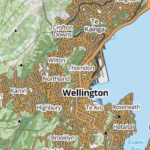
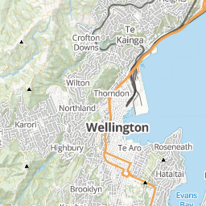
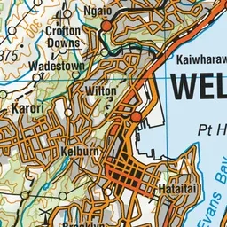
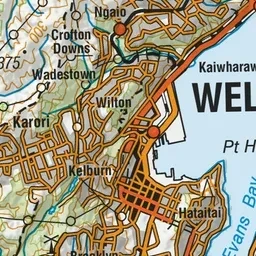
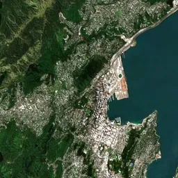
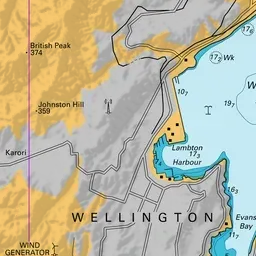
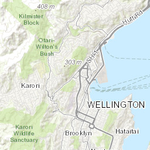
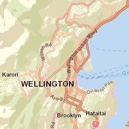
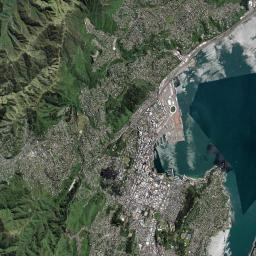

# Maps

The map is the core of the Common Operating Picture (COP) — everything else in TAK.NZ (positions, channels, Missions, feeds) is displayed on top of it. TAK.NZ clients let you choose what the map itself looks like and what reference data it shows underneath your team's positions and markers.

## Basemaps and imagery

Every TAK.NZ client ships with a choice of basemap layers, typically including:

- **Street/topographic maps** — good general-purpose reference, showing roads, contours, and place names
- **Satellite imagery** — useful for identifying terrain features, vegetation, and structures not shown on a standard map
- **Hybrid views** — imagery with road and label overlays combined

You can switch basemaps at any time from the map layers menu in your client. Which basemaps are available, and how far you can zoom in, depends on your client and your internet connectivity at the time.

### Available maps

The table below shows the basemaps currently available on TAK.NZ, with an example tile of the same Wellington location so you can compare styles at a glance.

<table class="tak-maps-table" markdown="1">
| # | Map | Description | Example |
|---|---|---|---|
| 01 | LINZ Topographic (Raster) | Full-colour NZ topographic map with contours, terrain shading, roads, and place names. |  |
| 02 | LINZ Topolite (Raster) | The same topographic data as above, in a lighter, muted colour palette so overlays and markers stand out more clearly on top. |  |
| 03 | LINZ Topo Maps | The full-colour topographic style with a reference grid overlaid, similar to a traditional printed topo map. |  |
| 04 | LINZ Topo Gridless Maps | The same topographic style as above, without the reference grid. |  |
| 05 | LINZ Aerial Imagery | Real aerial/satellite photography of New Zealand rather than a drawn map. |  |
| 06 | LINZ Nautical Charts | Maritime chart styling with water depth soundings, navigation hazards, and harbour detail. |  |
| 31 | ArcGIS World Topo Map | Esri's general-purpose colour topographic basemap, showing terrain, roads, and labels worldwide. |  |
| 32 | ArcGIS World Street Map | Esri's street-level basemap, emphasising roads, transport, and points of interest. |  |
| 33 | ArcGIS World Imagery | Esri's satellite and aerial imagery basemap, covering areas outside New Zealand where LINZ imagery isn't available. |  |
</table>

## Overlays and layers

On top of the basemap, TAK.NZ can display additional overlay layers, such as:

- Hazard zones, boundaries, and area markers drawn by your team
- Weather radar or other environmental data, where configured
- External feeds like [ADS-B (Aircraft)](../feeds/adsb.md) and [AIS (Vessels)](../feeds/ais.md)
- Content shared through [Missions](../data-sync/index.md) or imported [Data Packages](../data-packages/index.md)

Overlays can be toggled on and off independently, so you can keep the map focused on what's relevant to the task at hand rather than showing everything at once.

## Offline maps

Field operations don't always have reliable connectivity. Most TAK.NZ clients let you pre-download map tiles for a specific area and zoom range before you deploy, so the basemap keeps working even without a data connection. Positions, GeoChat messages, and Mission updates will still queue and sync once connectivity returns, but the basemap itself needs to already be cached locally to keep displaying while offline.

Check your specific client's guide — [CloudTAK](../clients/cloudtak.md), [ATAK](../clients/atak.md), [TAK Aware](../clients/takaware.md), or [WinTAK](../clients/wintak.md) — for how to download offline map data ahead of a deployment.

## Why this matters for public safety

A shared, accurate basemap is what makes the Common Operating Picture actually common — everyone needs to be looking at the same ground truth, whether that's the shape of a fire boundary, the layout of roads into a search area, or the terrain around a rescue site. Being able to work from cached maps when there's no signal means the map keeps working exactly when it matters most: in the field, away from cell coverage.
